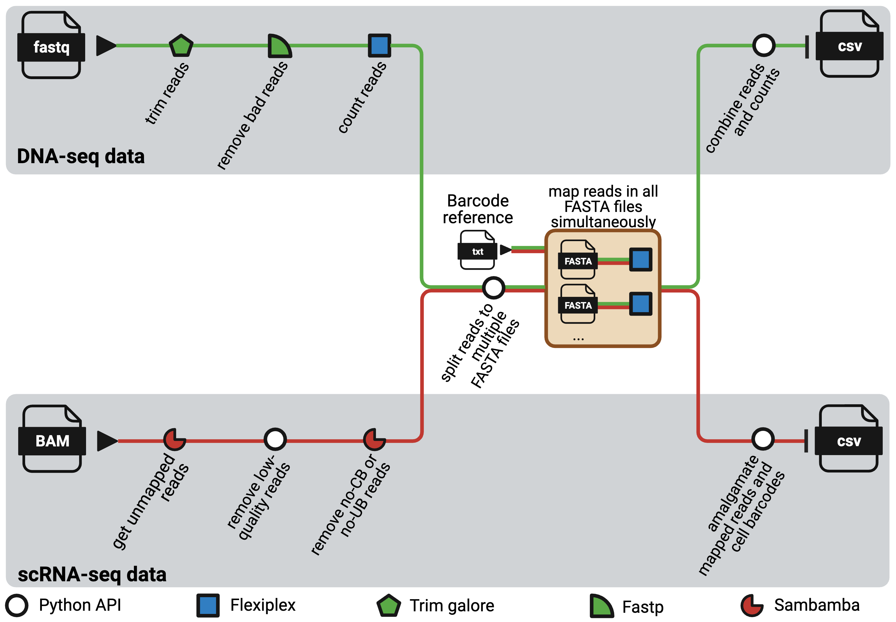

# NextClone

NextClone is a Nextflow pipeline to facilitate rapid extraction and quantification 
of clonal barcodes from both DNA-seq and scRNAseq data.
DNA-seq data refers to dedicated DNA barcoding data which exclusively sequences 
the synthetic lineage tracing clone barcode reads using Next Generation Sequencing.

  

The pipeline comprises two distinct workflows, one for DNA-seq data and the other for scRNAseq data. 
Both workflows are highly modular and adaptable, with software that can easily be substituted as required, 
and with parameters that can be tailored through the nextflow.config file to suit diverse needs.
It is heavily optimised for usage in high-performance computing (HPC) platforms.

## Documentation

For instructions on how to use *NextClone*, please visit the [user guide](https://phipsonlab.github.io/NextClone/).

<!-- ## Citation -->

<!-- If you use NextClone in your study, please kindly cite our preprint on bioRxiv. -->