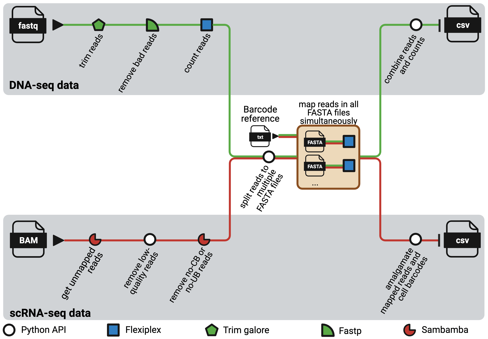

# NextClone

NextClone is a Nextflow pipeline to facilitate rapid extraction and quantification 
of clonal barcodes from both DNA-seq and scRNAseq data.
DNA-seq data refers to dedicated DNA barcoding data which exclusively sequences 
the synthetic lineage tracing clone barcode reads using Next Generation Sequencing.

<p>  </p>

The pipeline comprises two distinct workflows, one for DNA-seq data and the other for scRNAseq data. 
Both workflows are highly modular and adaptable, with software that can easily be substituted as required, 
and with parameters that can be tailored through the nextflow.config file to suit diverse needs.
It is heavily optimised for usage in high-performance computing (HPC) platforms.

## Usage

### For DNA-seq data

```
nextflow run phipsonlab/Nextclone \
    -r main \
    --mode DNAseq \
    --n_chunks 30 \
    --publish_dir output_20231109 \
    --clone_barcodes_reference data/known_barcodes.txt \
    --dnaseq_fastq_files data/dnaseq_fastq_files/
```

The above parameters are pretty much the barebone requirement:

* `-r` will pull the workflow from this Github repository, specifically the master branch.
* `--mode` tells NextClone to run the workflow for DNA-seq data.
* `--n_chunks` denotes how many chunks to split the reads to. Refer to *parallelisation within sample* section for more info.
* `--publish_dir` specifies the directory to copy the intermediate files and the final output to.
* `--clone_barcodes_reference` the location of the text file containing the list of reference clone barcodes to map the reads to.
* `--dnaseq_fastq_files` the location of the FASTQ files containing your raw DNA-seq data.

### For scRNAseq

Before running NextClone, make sure you run cellranger first, and copy out the `possorted_genome_bam` file in the `outs` folder.

```
nextflow run phipsonlab/Nextclone \
    -r main \
    --mode scRNAseq \
    --n_chunks 200 \
    --publish_dir output_20231109 \
    --clone_barcodes_reference data/known_barcodes.txt \
    --scrnaseq_bam_files data/scrnaseq_bam_files/
```

The above parameters are pretty much the barebone requirement:

* `-r` will pull the workflow from this Github repository, specifically the master branch.
* `--mode` tells NextClone to run the workflow for scRNAseq data.
* `--n_chunks` denotes how many chunks to split the reads to. Refer to *parallelisation within sample* section for more info.
* `--publish_dir` specifies the directory to copy the intermediate files and the final output to.
* `--clone_barcodes_reference` the location of the text file containing the list of reference clone barcodes to map the reads to.
* `--scrnaseq_bam_files` the location of the BAM file generated by cellranger.

## Parallelisation within sample

The Python package within NextClone divides reads into several
FASTA files, which can be increased from the default two as
needed through the `n_chunks` parameter. 

Each FASTA file then undergoes a mapping process against a reference list of clonal barcode sequences using [Flexiplex](https://github.com/DavidsonGroup/flexiplex) running on multiple threads. 
Each mapping task is submitted as an individual job to the HPC scheduler, allowing all the tasks to be processed simultaneously as resources permit. 

## Parameters

These are all the default parameters used by NextClone.
They are all in the `nextflow.config` file.

If you want to modify any of these, you can use the commands above, but specify the parameter name and the modified value.
For example, if you want to modify `n_chunks`, make sure you specify `--n_chunks` after the `run` command.

```
publish_dir_mode = 'copy'

mode = "DNAseq"

// generic
publish_dir = "${projectDir}/output"
clone_barcodes_reference = "${projectDir}/data/known_barcodes_subset.txt"
barcode_edit_distance = 2
n_chunks = 2
barcode_length = 20
// mapping may need long time, so use either long_mapping or regular_mapping
mapping_process_profile = "regular_mapping"


// for DNA-seq data
dnaseq_fastq_files = "${projectDir}/data/dnaseq_fastq_files"
fastp_percent_bases_unqualified = 20
fastp_phred_for_qualified_reads = 30

// for clonmapper single cell data
// change me if required
scrnaseq_bam_files = "${projectDir}/data/scrnaseq_bam_files"
phred_thres = 30
adapter_edit_distance = 6
adapter_5prime_clonmapper = "ATCTTGTGGAAAGGACGAAACACCG"
adapter_3prime_clonmapper = "GTTTCAGAGCTATGCTGGAAACAGC"
```

Explanation:

* `publish_dir_mode`: determine whether to copy the intermediate files out or not. See Nextflow's [documentation](https://www.nextflow.io/docs/latest/process.html) for options.
* `mode`: tells NextClone to run the workflow for DNA-seq or scRNA-seq data. Options are DNAseq or scRNAseq (case sensitive).
* `publish_dir`: specifies the directory to copy the intermediate files and the final output to.
* `clone_barcodes_reference`: the location of the text file containing the list of reference clone barcodes to map the reads to.
* `barcode_edit_distance`: maximum edit distance to barcode when mapping. Used by Flexiplex.
* `n_chunks`: denotes how many chunks to split the reads to. Refer to *parallelisation within sample* section for more info.
* `barcode_length`: length of your lineage tracing barcode. 
* `mapping_process_profile`: the HPC config used for mapping. Sometimes, mapping can take a long time, and it can be so long that you need to queue to task to a different queue. See the spec in the `base.config` file in `conf` folder.
* `dnaseq_fastq_files` the location of the FASTQ files containing your raw DNA-seq data.
* `fastp_percent_bases_unqualified`: the default value 20 basically meant reads with over 20% of their nucleotides with phred quality scores below 30 (set by `fastp_phred_for_qualified_reads`) are removed.
* `fastp_phred_for_qualified_reads`: see `fastp_percent_bases_unqualified`. They work hand in hand.
* `scrnaseq_bam_files` the location of the BAM file generated by cellranger.
* `phred_thres`: the threshold used to remove low-quality reads from scRNAseq data. Reads with a mean phred score lower than this threshold are removed.
* `adapter_edit_distance`: the maximum edit distance used by Flexiplex when matching the adapters for the clone reads.
* `adapter_5prime_clonmapper`: the 5' sequence for your clone barcodes. 
* `adapter_5prime_clonmapper`: the 3' sequence for your clone barcodes. 

<!-- ## Citation -->

<!-- If you use NextClone in your study, please kindly cite our preprint on bioRxiv. -->